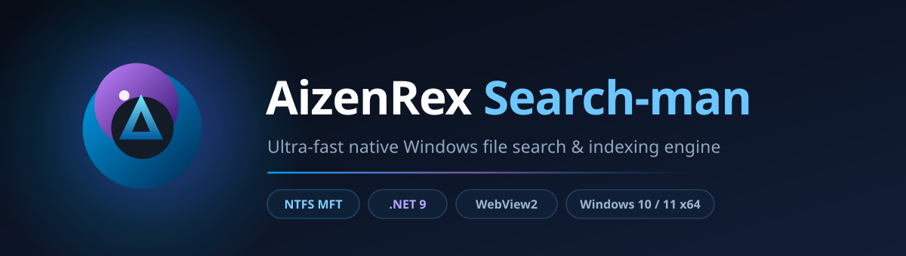
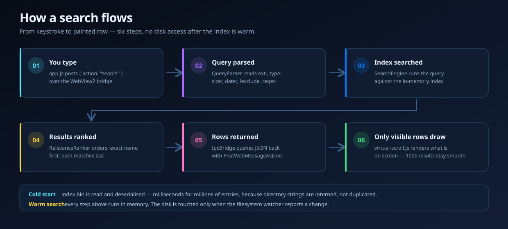
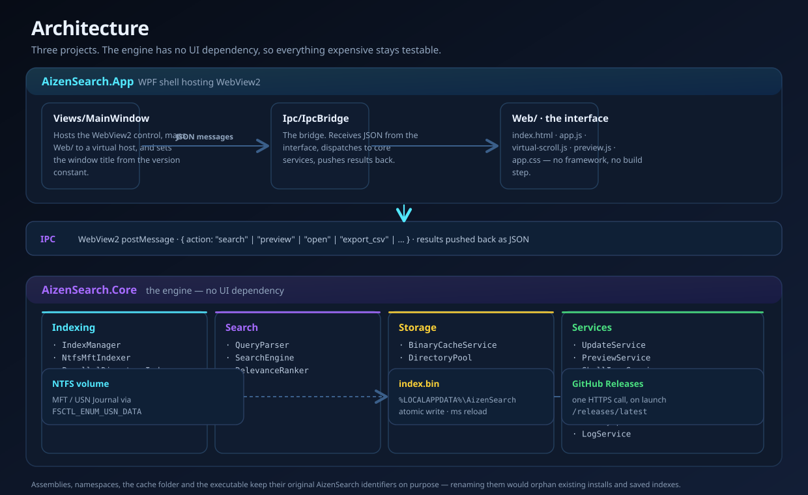

<div align="center">

<picture>
  <source media="(prefers-color-scheme: light)" srcset="docs/assets/banner-light.svg">
  <source media="(prefers-color-scheme: dark)" srcset="docs/assets/banner.svg">
  
</picture>

<br>

**An ultra-fast native file search engine for Windows.**
Built directly on the NTFS Master File Table, driven by a modern web interface, shipped as a single desktop app.

<br>

[](https://github.com/aizenrexx/AizenRex-Search-man/actions/workflows/release.yml)
[](https://github.com/aizenrexx/AizenRex-Search-man/releases/latest)
[](https://github.com/aizenrexx/AizenRex-Search-man/releases)
[](#requirements)
[](#requirements)
[](license.txt)

<br>

[**Download**](#-download--install) &nbsp;·&nbsp; [**Features**](#-features) &nbsp;·&nbsp; [**Search syntax**](docs/SEARCH-SYNTAX.md) &nbsp;·&nbsp; [**Architecture**](docs/ARCHITECTURE.md) &nbsp;·&nbsp; [**Manual**](docs/manual/) &nbsp;·&nbsp; [**Build & release**](docs/BUILD-AND-RELEASE.md)

</div>

---

## ✦ What it is

AizenRex Search-man indexes your drives by reading the NTFS **Master File Table** directly, so an entire disk becomes searchable in seconds instead of minutes. Results appear as you type, and the WebView2 front end renders them in list, card, or compact view with instant previews.

No background service. No indexing daemon. No cloud account. It is a **.NET 9 desktop application** — open it, search, close it.

<div align="center">

| | |
|:---|:---|
| **Runtime** | C# 13 · .NET 9 · `net9.0-windows` |
| **Interface** | WPF shell hosting Microsoft Edge WebView2 |
| **Index source** | NTFS MFT / USN Journal via `FSCTL_ENUM_USN_DATA`, with a parallel directory crawl fallback |
| **Index storage** | Binary cache — `%LOCALAPPDATA%\AizenSearch\index.bin` |
| **Installer** | Inno Setup 6 · per-machine · in-place upgrades |
| **Tests** | xUnit, run on every release build |

</div>

---

## ⚡ Why it is fast

<table>
<tr><td width="33%" valign="top">

**Reads the file table, not the files**

Windows already knows every file on an NTFS volume. Instead of walking directories and asking the filesystem about each one, the engine reads that table directly through `FSCTL_ENUM_USN_DATA` — one bulk operation instead of millions of calls.

</td><td width="33%" valign="top">

**Keeps the index small**

Paths repeat enormously, so every directory string is interned into a shared pool rather than stored once per file. The index is written to disk as a compact binary cache and reloads in milliseconds.

</td><td width="33%" valign="top">

**Renders only what you see**

The result list is virtualised — a query matching hundreds of thousands of files still only draws the rows on screen, so scrolling stays smooth no matter how broad the search.

</td></tr>
</table>

### From keystroke to painted row

<div align="center">
<picture>
  <source media="(prefers-color-scheme: light)" srcset="docs/assets/search-flow-light.svg">
  <source media="(prefers-color-scheme: dark)" srcset="docs/assets/search-flow.svg">
  
</picture>
</div>

After the index is warm, every one of those steps runs **in memory**. The disk is touched only when the filesystem watcher reports a change.

---

## 📦 Download & install

Grab the newest build from the [**Releases**](https://github.com/aizenrexx/AizenRex-Search-man/releases/latest) page.

<div align="center">

| File | What it is |
|:---|:---|
| **`AizenRex-Search-man-Setup-vX.Y.Z.exe`** | **Installer.** Installs for all users, adds Start Menu entries, and offers an optional desktop icon, launch-on-startup, and a *Search with AizenRex Search-man* Explorer context menu. Installing over an older version upgrades in place — your index and settings are kept. |
| **`AizenRex-Search-man-vX.Y.Z-Portable.zip`** | **Portable.** Unzip anywhere and run `AizenSearch.App.exe`. Writes nothing outside its own folder except the index cache. |

</div>

### Requirements

- Windows 10 or Windows 11, **x64**
- [**.NET 9 Desktop Runtime (x64)**](https://dotnet.microsoft.com/download/dotnet/9.0) — the build is framework-dependent, which keeps the download small

### Verify your download

Every release prints the SHA256 of both files. Check yours before running it:

```powershell
Get-FileHash .\AizenRex-Search-man-Setup-vX.Y.Z.exe -Algorithm SHA256
```

The result must match the release page exactly. **If it does not, do not run the file.**

<details>
<summary><b>Windows says "Windows protected your PC" — is that a problem?</b></summary>

<br>

No. That blue box is SmartScreen noticing the installer has **no digital signature** — it means Windows does not know who built the file, not that anything was found in it.

Click **More info** → **Run anyway**. The prompt fades as the download builds reputation.

Removing it permanently requires a **code-signing certificate**. The release pipeline is already wired for one — add repository secrets `WINDOWS_CERT_PFX_BASE64` and `WINDOWS_CERT_PASSWORD` and every future release is signed and timestamped automatically, with no other change. See [docs/SECURITY-AND-SECRETS.md](docs/SECURITY-AND-SECRETS.md).

</details>

---

## 🧭 Features

<table>
<tr><td width="50%" valign="top">

### Searching

- **Live results as you type** over an index of the whole drive
- **MFT / USN indexing** — millions of entries in seconds, with a directory-crawl fallback for non-NTFS volumes
- **Advanced query syntax** — `ext:`, `type:`, `path:`, `size:`, `date:`, `!exclude`, `"exact phrases"`, `*`/`?` wildcards, and full regular expressions
- **Match case**, **whole word**, and **search in path** toggles
- **Relevance ranking**, plus sort by name, path, or type
- **Filter chips** — Videos, Audio, Documents, Pictures, Applications, Archives, Folders

</td><td width="50%" valign="top">

### Working with results

- **List, card, and compact** view modes
- **Instant preview pane** for images, text, and metadata
- Open · open containing folder · copy path · copy name · copy file hash · Properties
- **Export results to CSV**
- **Find duplicate files**
- Right-click context menu with all of the above

### The app itself

- **Single-instance** — opening a second copy forwards its arguments to the running one
- **Real-time index updates** via a filesystem watcher
- **Light and dark themes**
- **Manual elevation** (*Enable MFT / Admin*) for raw MFT access
- **In-app update check** against this repository's latest release
- Built-in version history and query-help dialogs

</td></tr>
</table>

---

## 🔍 Search syntax

| Syntax | Meaning | Example |
|:---|:---|:---|
| `word` | Match anywhere in the name or path | `report` |
| `"exact phrase"` | Match the phrase as written | `"annual report"` |
| `ext:pdf` | Only this extension — pipe for several | `ext:pdf\|docx` |
| `type:video` | Filter by kind — `file` `folder` `exe` `doc` `image` `audio` `video` `archive` | `type:image` |
| `path:downloads` | Force the term to match the path | `path:downloads` |
| `size:>500mb` | Size filter — `>`, `<`, `min-max`, or exact | `size:100mb-2gb` |
| `date:after 2024-01-01` | Date filter — `after`, `before`, `between X and Y`, or a bare year | `date:2024` |
| `!term` | Exclude anything matching the term | `!backup` |
| `*.log` | Wildcard match | `*.tmp` |
| `^IMG_\d{4}` | Regular expression *(Regex toggle)* | `(mkv\|mp4)$` |

**Real queries, copied from daily use:**

```
type:video 2160p size:>20gb            # a 4K film bigger than 20 GB
type:doc date:after 2024-01-01 !draft  # this year's documents, minus drafts
path:downloads ext:exe|msi             # every installer in Downloads
path:DCIM type:image date:2024-03      # camera photos from March
```

📖 **Full reference with worked examples → [docs/SEARCH-SYNTAX.md](docs/SEARCH-SYNTAX.md)**

---

## 🏗 Repository layout

```text
AizenRex-Search-man/
│
├── src/
│   ├── AizenSearch.Core/          ← the engine (no UI dependency)
│   │   ├── Indexing/              MFT reader, directory crawl, index manager
│   │   ├── Search/                Query parser, search engine, relevance ranker
│   │   ├── Storage/               Binary cache, directory string pool
│   │   ├── Models/                FileEntry, SearchQuery, SearchResult …
│   │   └── Services/              Update, preview, icons, elevation, watcher …
│   │
│   └── AizenSearch.App/           ← the desktop shell
│       ├── Views/                 MainWindow
│       ├── Ipc/                   Bridge between native and web
│       └── Web/                   HTML · CSS · JavaScript (the interface)
│
├── tests/                         xUnit test project
├── Distribution/Portable/         Packaged portable build
├── scripts/                       Icon generation and screenshot helpers
├── legacy_rust/                   Archived original Rust implementation
├── docs/                          Architecture · syntax · build · security · manual
└── .github/workflows/release.yml  Cloud build and release pipeline
```

### How the pieces fit together

<div align="center">
<picture>
  <source media="(prefers-color-scheme: light)" srcset="docs/assets/architecture-light.svg">
  <source media="(prefers-color-scheme: dark)" srcset="docs/assets/architecture.svg">
  
</picture>
</div>

📖 **Guided tour of the codebase → [docs/ARCHITECTURE.md](docs/ARCHITECTURE.md)**

---

## 🛠 Build and run

```powershell
# run from source
dotnet run --project src/AizenSearch.App/AizenSearch.App.csproj

# run the tests
dotnet test AizenSearch.sln

# produce the portable build
dotnet publish src/AizenSearch.App/AizenSearch.App.csproj -c Release -r win-x64 `
  --self-contained false -o Distribution/Portable
```

### Releases are built in the cloud

Tagging is all it takes — **your PC does not need to be on**:

```powershell
git tag v0.3.9
git push origin v0.3.9
```

GitHub Actions then restores, builds, runs the full test suite, publishes the portable build, packages the ZIP, compiles the installer, and publishes the release. You can also run it manually from the **Actions** tab.

📖 **Full details, including the version rules → [docs/BUILD-AND-RELEASE.md](docs/BUILD-AND-RELEASE.md)**

---

## 📚 The complete manual

Everything about this software — how it works, how every file fits together, how to change any part of it, how to build and release, and how to use it — lives in **[`docs/manual/`](docs/manual/)**.

<div align="center">

| # | Chapter | Read it if you want to… |
|:---|:---|:---|
| **00** | [**Start here**](docs/manual/00-START-HERE.md) | know how to use the manual and the rules you must not break |
| **01** | [**How it works**](docs/manual/01-HOW-IT-WORKS.md) | understand the whole system, in plain language |
| **02** | [**The codebase**](docs/manual/02-THE-CODEBASE.md) | find which file owns the thing you want to change |
| **03** | [**How to modify**](docs/manual/03-HOW-TO-MODIFY.md) | make a change — 15 recipes, from a colour to a new search operator |
| **04** | [**Build, test and release**](docs/manual/04-BUILD-TEST-RELEASE.md) | build it, test it, or publish a release |
| **05** | [**User guide**](docs/manual/05-USER-GUIDE.md) | use the app — every menu, shortcut, query, and fix |

</div>

It is written to be read by **anyone** — a person new to the project, or an AI assistant picking it up cold — and it is kept in the repository so it never drifts away from the code.

---

## 🔒 Security & privacy

- The application makes **exactly one network call** — an update check against this repository's latest release. No telemetry, no analytics, no account.
- Your index and settings stay in `%LOCALAPPDATA%\AizenSearch` on your own machine and are **never uploaded anywhere**.
- **No credentials, certificates, tokens, or machine-specific paths** are stored in this repository. See [`.gitignore`](.gitignore) and [docs/SECURITY-AND-SECRETS.md](docs/SECURITY-AND-SECRETS.md).
- Found a problem? Please report it privately — see [SECURITY.md](SECURITY.md).

---

## ❓ FAQ

<details>
<summary><b>Does it need to run as administrator?</b></summary>

<br>

Not to search. Raw MFT access needs elevation, so the app offers an **Enable MFT / Admin** action — grant it and indexing gets much faster. Without it the engine falls back to a parallel directory crawl, which is slower but works everywhere, including network and non-NTFS drives.

</details>

<details>
<summary><b>Where is my index stored? Can I delete it?</b></summary>

<br>

At `%LOCALAPPDATA%\AizenSearch\index.bin`. Deleting it is safe — the app rebuilds on next launch, and your settings are stored separately.

</details>

<details>
<summary><b>Will upgrading lose my index or settings?</b></summary>

<br>

No. Upgrades install in place and deliberately leave `%LOCALAPPDATA%\AizenSearch` untouched, so your index, preferences, and search history carry over.

</details>

<details>
<summary><b>Why is the executable still called <code>AizenSearch.App.exe</code>?</b></summary>

<br>

The user-facing product is **AizenRex Search-man**, but internal assembly names, namespaces, the cache folder, and the executable keep their original `AizenSearch` identifiers on purpose. Renaming them would orphan existing installations, upgrade paths, and saved indexes.

</details>

<details>
<summary><b>Can I use it on a machine without .NET 9?</b></summary>

<br>

The published build is framework-dependent, so it needs the [.NET 9 Desktop Runtime](https://dotnet.microsoft.com/download/dotnet/9.0). You can also build it self-contained from source if you need a standalone copy.

</details>

<details>
<summary><b>Where do I start if I want to change the code?</b></summary>

<br>

Read **[`docs/manual/00-START-HERE.md`](docs/manual/00-START-HERE.md)** first, then the codebase map in **[`docs/manual/02-THE-CODEBASE.md`](docs/manual/02-THE-CODEBASE.md)**, then find the closest recipe in **[`docs/manual/03-HOW-TO-MODIFY.md`](docs/manual/03-HOW-TO-MODIFY.md)**. Those three cover almost everything, including the rules that are easy to break without noticing.

</details>

---

<div align="center">

<br>

**Built by Riyad (Aizen)**

[Report an issue](https://github.com/aizenrexx/AizenRex-Search-man/issues) · [Latest release](https://github.com/aizenrexx/AizenRex-Search-man/releases/latest) · [License](license.txt)

<sub>AizenRex Search-man · Professional Edition</sub>

</div>